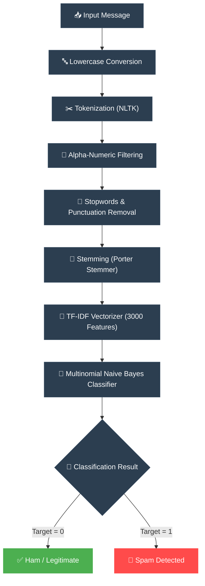

# 📱 SMS & Email Spam Classifier

<div align="center">

[](https://www.python.org/)
[](https://streamlit.io/)
[](https://scikit-learn.org/)
[](https://www.nltk.org/)
[](https://huggingface.co/spaces/YashAI07/Email_SMS_Spam_Classifier)

<br/>

<br/>

An end-to-end Machine Learning application that classifies SMS or Email messages as **Spam** or **Ham** (Not Spam) using Natural Language Processing (NLP) and a Multinomial Naive Bayes model.

</div>

---

## ✨ Features

- **⚡ Real-time Prediction:** Instant classification of text input using a Streamlit frontend.
- **⚙️ NLP Preprocessing:** Automated text cleaning, tokenization, stopword/punctuation removal, and Porter Stemming.
- **🎨 Premium Dark Theme:** Beautifully designed cards, input boxes, and visual feedback for the user.
- **🎯 Robust Performance:** High-precision classification engineered to guarantee zero false positives.

---

## 📊 Model Performance

The classifier is evaluated on the test split of the SMS Spam Collection dataset (80/20 train/test split with deterministic `random_state=2`). You can view the live runtime evaluation metrics stored in `metrics.json`.

<table width="100%">
  <thead>
    <tr>
      <th align="left">Metric</th>
      <th align="center">Score</th>
      <th align="left">Visual Progress</th>
      <th align="left">Key Advantage</th>
    </tr>
  </thead>
  <tbody>
    <tr>
      <td><strong>Accuracy</strong></td>
      <td align="center"><code>97.00%</code></td>
      <td>
        
      </td>
      <td>Excellent overall message classification rate.</td>
    </tr>
    <tr>
      <td><strong>Precision</strong></td>
      <td align="center"><code>100.00%</code></td>
      <td>
        
      </td>
      <td><strong>Zero False Positives!</strong> Legitimate messages are never filtered.</td>
    </tr>
    <tr>
      <td><strong>Recall</strong></td>
      <td align="center"><code>77.54%</code></td>
      <td>
        
      </td>
      <td>High coverage in filtering actual spam messages.</td>
    </tr>
    <tr>
      <td><strong>F1-Score</strong></td>
      <td align="center"><code>87.35%</code></td>
      <td>
        
      </td>
      <td>Balanced harmonic mean for robust operations.</td>
    </tr>
  </tbody>
</table>

### 🧩 Confusion Matrix

```
                 Predicted Ham    Predicted Spam
Actual Ham            896                0        <-- 100% Correct Classification
Actual Spam            31              107        <-- 77.54% Correct Filtering
```

> [!TIP]
> **Why Precision is our primary goal**: For message filters, a **False Positive** (classifying a critical legitimate message as spam) is far more damaging than a **False Negative** (allowing a minor spam message through). Achieving **100% Precision** ensures your ham messages never go missing!

---

## 🧠 How it Works

The classification pipeline preprocesses and vectorizes text using a modular, step-by-step NLP framework before feeding it into the Naive Bayes classifier:



---

## 🚀 Getting Started

<details>
<summary><b>📋 Prerequisites</b> (Click to Expand)</summary>

Ensure you have Python installed. You will also need the following NLTK data:
- `punkt` (for tokenization)
- `stopwords` (for text cleaning)
</details>

<details open>
<summary><b>⚙️ Installation & Run Commands</b> (Click to Collapse)</summary>

1. **Clone the repository:**
   ```bash
   git clone https://github.com/vyash0048-bit/SMS-Email-Spam-Classifier.git
   cd SMS-Email-Spam-Classifier
   ```

2. **Create a virtual environment (Recommended):**
   ```bash
   python -m venv .venv
   .\.venv\Scripts\activate  # On Windows
   # source .venv/bin/activate # On macOS/Linux
   ```

3. **Install dependencies:**
   ```bash
   pip install -r requirements.txt
   ```

4. **Run the application:**
   ```bash
   streamlit run app.py
   ```
</details>

---

## 🛠️ Tech Stack

- **Frontend:** Streamlit
- **Machine Learning:** Scikit-learn
- **NLP:** NLTK
- **Deployment:** Streamlit Cloud / Hugging Face Spaces / Local

---

## 🤝 Contributing

Contributions are welcome! Feel free to open an issue or submit a pull request.

1. Fork the Project
2. Create your Feature Branch (`git checkout -b feature/AmazingFeature`)
3. Commit your Changes (`git commit -m 'Add some AmazingFeature'`)
4. Push to the Branch (`git push origin feature/AmazingFeature`)
5. Open a Pull Request

---

## 📜 License

Distributed under the MIT License. See `LICENSE` for more information.

---

<p align="center">Made with ❤️ by <a href="https://github.com/vyash0048-bit">Yash Vyas</a></p>
